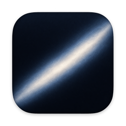
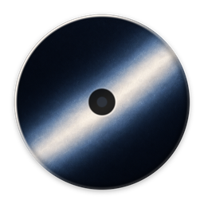

<p align="center">
  
</p>

# Overnight

A macOS menu-bar switch that keeps a MacBook awake overnight, on AC, with the lid closed — and puts your power settings back at a wake time you choose.

It replaces running this by hand:

```sh
sudo pmset -a disablesleep 1 sleep 0 disksleep 0 powernap 0 displaysleep 2 tcpkeepalive 1
```

That command has three problems Overnight fixes. It writes the battery profile as well as the AC one. It has no inverse, so turning it off means remembering values nobody wrote down. And it never ends — a forgotten `disablesleep 1` keeps a closed laptop awake in a bag until the battery is flat.

## What it actually does

Turning Overnight on, behind one administrator prompt:

1. Records the current values of `sleep`, `disksleep`, `displaysleep`, `powernap`, and `tcpkeepalive` for **both** the AC and battery profiles, plus the system-wide sleep-disable flag.
2. Installs a root-owned copy of the restore script and arms a one-shot `launchd` job for your wake time.
3. Applies the overnight profile: `sleep 0 disksleep 0 displaysleep 2 powernap 0` scoped to **AC only**, and `disablesleep 1`.

At the wake time the `launchd` job replays exactly what step 1 recorded and deletes itself. Turning Overnight off by hand runs the same restore.

**It never writes your battery profile**, and it never writes a setting it did not first record.

## Install

Overnight is unsigned. That is a deliberate scope decision, not an oversight — Developer ID signing and notarization are out of scope for this project.

1. Download `Overnight.dmg` from [Releases](https://github.com/lucabattistini/overnight/releases).
2. The DMG opens onto a small window with Overnight on the left and an arrow pointing at Applications on the right. Drag it across.
3. The first launch will be blocked. Right-click the app and choose **Open**, then **Open** again in the dialog. Or open **System Settings → Privacy & Security**, find the blocked-app notice, and click **Open Anyway**.
4. Overnight has no Dock icon. Look for the S-shaped band in the menu bar, up near the clock.

To build it yourself on a Mac:

```sh
sh scripts/make-dmg.sh
```

That produces the same drag-to-install DMG the releases carry: a 600×400 Finder window with no
toolbar or status bar, 128pt icons at fixed positions over a branded background, and a volume
that carries its own icon rather than the generic white disk. The layout is set by asking Finder
for it through `osascript`, which is the only supported way to write the icon-view state a DMG
keeps in its `.DS_Store`, so the first run on a fresh Mac may ask you to allow the terminal to
control Finder. Nothing outside macOS's own tools is involved — `hdiutil`, `tiffutil`,
`osascript` and `xattr` — and there is no third-party packaging dependency.

### The branding assets are checked-in build products

Everything visual comes from one file, `resources/branding/OvernightIconMaster.png`, and is
generated by `python3 scripts/icons.py build` using nothing but the Python standard library:

| Generated | What it is |
|---|---|
| `resources/Overnight.icns` | the app bundle's icon |
| `resources/branding/OvernightIcon-256.png` | the one at the top of this file |
| `resources/VolumeIcon.icns` | the mounted DMG's icon — a platter, not a copy of the app icon |
| `resources/branding/OvernightVolumeIcon-256.png` | the same at a size you can look at |
| `resources/branding/OvernightDMGBackground.png` and `@2x` | the installer window, paired into a Retina TIFF at packaging time |

They are committed rather than built during packaging because `iconutil` and `sips` only exist
on macOS, and artwork rebuilt during packaging is artwork that can differ between machines. CI
runs `python3 scripts/icons.py verify` on every push, which re-derives all of it from the master
and compares decoded pixels, so a stale or hand-edited asset fails the build rather than
shipping.

<p align="center">
  
</p>

The installer window's geometry lives in `resources/branding/dmg-layout.env`, which both
`scripts/make-dmg.sh` and `scripts/icons.py` read — the packaging script to place the window and
the icons, the icon script to paint the arrow between them. `sh scripts/check-dmg-layout.sh`
fails the build if those three ever stop agreeing.

## Usage

Click the menu bar icon. Pick a wake time. Click **Turn On** and approve the administrator prompt.

The icon itself is the status. It is one band — the app icon's galactic band seen edge-on, an S that leaves each end almost flat and sweeps steeply through the middle — drawn two ways: **broken in the middle when Overnight is off**, and **continuous when Overnight is holding this Mac awake**. The break lands on the inflection, where the band is steepest, so the two states are tellable apart in peripheral vision. They differ in shape rather than colour, and the glyph is a template image, so it follows a light or dark menu bar on its own.

The band is geometry rather than a bitmap: `MenuBarBand` in `OvernightCore` describes it as one cubic Bézier whose control points are a single arm vector reflected through the chord's midpoint, and the app re-strokes it at whatever backing scale the menu bar asks for. That is what keeps it sharp on a Retina display, and it is why the shape can be unit-tested without a screen.

While it is on, the menu shows the deadline and offers **Update Deadline** and **Turn Off Now**. Both raise an administrator prompt, because changing power settings needs root and Overnight keeps no standing privilege.

Updating the deadline moves the wake time and re-arms the timer. It does **not** re-record your settings — the capture taken when you first turned Overnight on is kept, so the values restored at the end are always your real ones, however many times you extend.

The menu-bar state is read from the machine, not remembered. Quit the app, relaunch it, or reboot, and it will still tell you whether sleep is actually disabled.

## The limitation you should know about

**`disablesleep` is global. It cannot be scoped to AC power.**

`pmset -c disablesleep 1` looks like it scopes the flag to AC. It does not. It exits 0, prints no warning, and sets the system-wide flag anyway — confirmed on macOS 26.6 on 2026-09-09. The timer settings (`sleep`, `disksleep`, `displaysleep`, `powernap`) do scope correctly with `-c`; `disablesleep` does not.

So while Overnight is on, **this Mac will not sleep on battery either**. Overnight handles that in the only way possible without installing a permanent root daemon:

- It watches the power source and notices immediately when you unplug.
- It posts a notification and raises the restore prompt straight away.
- **If nobody is there to approve that prompt, the machine stays awake on battery until the deadline.** The `launchd` deadline job is the backstop and still fires.

Unplugging a running Overnight session and walking away will drain the battery. Turn Overnight off before you unplug.

## Security

See [SECURITY.md](SECURITY.md) for the full threat model. In short: root is held only for the seconds each script runs, no privileged daemon or helper is installed, `launchd` executes a root-owned copy of the restore script rather than the one in the user-writable app bundle, and every value reaching a shell command is validated as digits-only on both the Swift and shell sides.

## Recovery

If the app is gone, broken, or you just want your Mac to sleep again, Overnight is fully reversible from Terminal.

```sh
# What is the machine actually doing?
pmset -g | grep SleepDisabled
pmset -g custom

# What did Overnight record before it changed anything?
sudo cat "/Library/Application Support/Overnight/state.conf"
```

The state file lists the exact prior values. Replay the `ac_*` lines and the flag:

```sh
# Substitute the values from state.conf.
sudo pmset -c sleep 30 disksleep 10 displaysleep 10 powernap 1
sudo pmset -a disablesleep 0
```

Or just run the installed restore script, which does exactly that:

```sh
sudo /bin/sh "/Library/Application Support/Overnight/overnight-restore.sh"
```

Then remove the timer if it is still armed:

```sh
sudo launchctl bootout system/dev.lucabattistini.overnight.restore
sudo rm -f /Library/LaunchDaemons/dev.lucabattistini.overnight.restore.plist
```

Do **not** use `pmset restoredefaults`. It resets power management as a group and will discard settings Overnight never touched.

## Uninstall

```sh
sudo /bin/sh "/Library/Application Support/Overnight/overnight-restore.sh"   # restore first
sudo rm -rf "/Library/Application Support/Overnight"
sudo rm -f /Library/LaunchDaemons/dev.lucabattistini.overnight.restore.plist
rm -rf /Applications/Overnight.app
```

The restore script is left on disk after a normal restore, because a shell script cannot safely delete the file it is currently executing. It is root-owned and nothing references it once the job's plist is gone.

## What is verified, and what is not

This matters more than usual here, because the app changes system power behaviour.

**Verified on hardware** — MacBook Pro Mac16,7 / M4 Pro / macOS 26.6 (25G72), 2026-09-09:

| Check | Result |
|---|---|
| AC-only profile accepted | Pass. `sleep`, `disksleep`, `displaysleep`, `powernap` scope correctly with `-c` |
| `pmset -c disablesleep 1` scoping | **Fails silently.** Writes the global flag, exits 0, no warning. Drove the design above |
| Lid closed on AC, external display and input off | Pass. 89s continuous, zero sleep events, network active throughout |
| Exact restore | Pass. Battery profile byte-identical afterwards |
| One-shot `launchd` deadline restore | Pass. Fired as uid 0, exit 0, replayed the captured value, removed itself |

**Verified in CI** — `swift build`, `swift test`, `shellcheck`, the payload harness, and the DMG build all run on a macOS runner per push. The bundle is checked to carry the icon `Info.plist` names, and `iconutil` is asked to take that `.icns` apart again so a file macOS could not read fails the build. The finished DMG is then mounted and inspected: the app, the `Applications` alias, the background and the volume icon must all be present, the volume icon must survive `iconutil`, the volume's root must carry the `kHasCustomIcon` Finder flag, and the `.DS_Store` must contain the `icvp` and `Iloc` records Finder writes for icon-view options and hand-placed icons. That last pair is what would catch the layout silently not sticking.

**Verified on Linux during development** — the payload harness (65 assertions covering argument validation, the directory precondition, transaction ordering, injection rejection, and restore idempotency), the managed-key drift guard, the installer-window layout drift guard, and `scripts/icons.py verify`, which re-derives every icon, the volume icon and both installer backgrounds from the branding master. These exercise the scripts' control flow against stubbed binaries. **They prove nothing about how macOS responds to `pmset`, and nothing about how any of the artwork looks.**

**Not verified by anything yet:**

- Closed-lid runs longer than 90 seconds, and thermals under sustained closed-lid load.
- Actual AC loss while `disablesleep` is 1.
- Whether `disablesleep` survives a reboot.
- How the icons actually look. Both `.icns` files are checked structurally and the menu bar band's geometry is unit-tested, but no CI runner renders a Dock icon or a menu bar. [docs/MANUAL-CHECKS.md](docs/MANUAL-CHECKS.md) M8 covers the sizes, light and dark menu bars, Retina sharpness, and the VoiceOver label.
- How the installer window actually looks. CI proves Finder wrote a layout; it cannot prove the window is the right size, that the arrow lines up between the two icons, or that the item labels are legible. Finder takes those labels' colour from the system appearance rather than from the background behind them, so a dark installer window is a light-mode legibility risk specifically. [docs/MANUAL-CHECKS.md](docs/MANUAL-CHECKS.md) M9 covers it in both appearances.
- Whether `tcpkeepalive` scopes with `-c`. The spike machine already had it at 1 on both profiles, so a scoped write was indistinguishable from a global one. **Overnight therefore does not write `tcpkeepalive` at all.** It is still recorded in the capture. Nothing is lost: with `disablesleep 1` and `sleep 0` the machine never sleeps, and `tcpkeepalive` only governs behaviour during sleep.

The 89-second lid test ran with an unrelated `caffeinate -i -t 300` held by another process. `caffeinate -i` prevents idle sleep and should not prevent clamshell sleep, so the result is treated as provisionally positive rather than settled. [docs/MANUAL-CHECKS.md](docs/MANUAL-CHECKS.md) has a standalone re-test to run before any release.

### One restore is not exact, and cannot be

Toggling `powernap` causes macOS to add `SleepServices 1` to the AC profile. It is absent on a machine that has never had Power Nap toggled, it is a correct value, and **`pmset` provides no way to remove a key**. So after a full Overnight cycle, `pmset -g custom` will show one key that was not there before.

Every value Overnight recorded is restored exactly, and the behaviour is unchanged. Byte-identical textual restoration of `pmset -g custom` is not achievable for that implicit key by any tool.

## Not in scope

Telegram control, agent-run detection, wrapper CLIs, PID watchers, session history, multiple profile tiers, a privileged daemon or XPC helper, a sudoers rule, auto-update, App Store distribution, and notarization.

## License

MIT. See [LICENSE](LICENSE).
