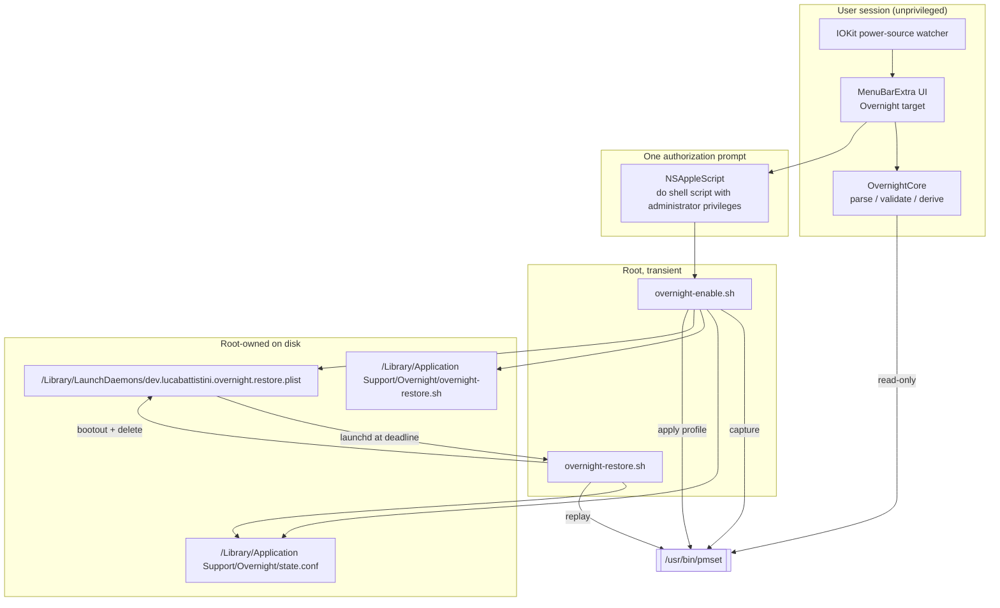

# Overnight macOS Menu-Bar App MVP - Plan

## Goal Capsule

- **Objective:** A MacBook Pro can be held awake overnight, closed and on AC, from a menu-bar toggle instead of a Terminal command — and the machine's original power settings come back on their own at a chosen wake time.
- **Means:** A SwiftUI `MenuBarExtra` app that drives a static, bundled shell payload through one administrator prompt, and arms a self-removing one-shot `launchd` job for the deadline restore (KTD1, KTD2, KTD5).
- **Authority:** Requirements (R-IDs) win on product behavior. KTDs win on mechanism within those requirements. Units override neither.
- **Execution profile:** Greenfield repository, initial import to `main`. The implementing host is Linux: Swift compilation and all runtime `pmset` behavior are unverifiable locally and route to CI and to the manual-check list.
- **Stop conditions:** Stop and report if the privileged payload cannot be made root-owned and non-user-writable at its execution path; if `pmset -g` on a supported macOS does not expose `SleepDisabled`; or if restoring captured values requires guessing any value the capture did not record.
- **Tail ownership:** The caller owns commit, push, and any release tagging.

---

## Product Contract

### Summary

Build `Overnight`, an open-source macOS menu-bar utility. It replaces manually running `sudo pmset -a disablesleep 1 sleep 0 disksleep 0 powernap 0 displaysleep 2 tcpkeepalive 1` from Terminal. The app captures the machine's current power settings, applies an overnight profile scoped to AC power, and schedules an automatic restore at a user-chosen wake time. Status is read back from live `pmset` output rather than from cached UI state, so a relaunched app tells the truth about whether the machine is still being held awake.

### Problem Frame

Running the script by hand has three failure modes that matter. The command is applied with `-a`, so it overwrites battery-profile settings that have nothing to do with an overnight run. It has no inverse: turning it off means remembering what the values used to be, which nobody does — so people run `pmset restoredefaults` and lose unrelated settings. And it has no end: a forgotten `disablesleep 1` keeps a closed laptop awake in a bag, on battery, until it is flat.

### Requirements

**Menu-bar control and deadline**

- R1. The app runs as a menu-bar-only agent with no Dock icon and no main window.
- R2. The menu bar shows a single Overnight control whose icon and label distinguish active from inactive at a glance.
- R3. Turning Overnight on requires choosing a wake-time deadline; there is no indefinite mode.
- R4. The deadline is expressed as a wall-clock time of day (for example `07:30`) and resolves to the next occurrence of that time, which is tomorrow when the time has already passed today.
- R5. While Overnight is active, the user can change or extend the deadline without first turning Overnight off.

**Power profile, capture, and restore**

- R6. Before any setting is changed, the app captures the current values of the settings it is about to modify, for both the AC and battery profiles, plus the system-wide sleep-disable flag.
- R7. The overnight profile sets `disablesleep 1` system-wide and sets `sleep 0`, `disksleep 0`, `powernap 0`, and `displaysleep 2` on the AC profile only. `tcpkeepalive` is captured but never written: the hardware spike could not verify its `-c` scoping, because the machine's baseline was already 1 on both profiles.
- R8. The battery profile is never written during enable.
- R9. Restore replays the captured values verbatim. It never writes a hardcoded default and never invokes `pmset restoredefaults`.
- R10. A setting absent from the capture — because the installed macOS or hardware does not expose it — is recorded as absent and is not written on restore.
- R11. Restore is idempotent: running it when nothing is active leaves the machine unchanged and exits successfully.

**Privilege and safety**

- R12. Privilege is obtained through a native administrator authorization prompt. One prompt on enable and one on manual disable are acceptable.
- R13. No file that a privileged process executes is writable by a non-root user at the time it is executed.
- R14. No persistent privileged service, XPC helper, sudoers rule, or login item is installed. The only privileged artifacts are the captured-state file, the restore payload, and a one-shot job that deletes itself.
- R15. Every value that reaches a shell command or a property list is validated against a strict allowlist at both the Swift and shell layers before use.
- R16. The saved state file is treated as untrusted input on read: unknown keys are ignored and out-of-range values abort the restore rather than being written.

**Status derivation and recovery**

- R17. Displayed status is derived from live `pmset` output combined with the saved state file, never from in-memory UI state alone.
- R18. On launch the app reports one of four states: off; active with a known deadline; active with the deadline job missing; or sleep disabled by something other than Overnight.
- R19. In the active-with-missing-job state the app offers to restore now or to re-arm the deadline.
- R20. When sleep is disabled but no Overnight capture exists, the app says so and offers no restore, because it has no baseline to replay.

**AC-power safety**

- R21. While Overnight is active, the app watches the power source and reacts the moment the machine moves to battery.
- R22. On unplug the app notifies the user and starts the restore immediately, which raises the authorization prompt. If the prompt is not answered, the warning stays visible and the deadline job remains the backstop.

**Distribution and documentation**

- R23. The repository builds an unsigned universal `Overnight.app` and packages it as a DMG through a scripted, reproducible command.
- R24. A tagged release publishes that DMG to GitHub Releases.
- R25. The README covers install, first-run Gatekeeper approval, usage, the security model, manual recovery from Terminal, and uninstall.

**Verification honesty**

- R26. The repository states which checks were actually executed and which are deferred to CI or to hardware, without conflating them.
- R27. The repository carries a short, ordered list of manual checks to run once on a real MacBook, each with the exact command and the expected observation.

### Key Decisions

- **Deadline is mandatory** (session-settled: user-directed — chosen over an indefinite stay-awake mode: a deadline bounds the blast radius of a forgotten toggle, which is the failure this product exists to remove). Governs R3, R4, R5.
- **Restore replays captured values** (session-settled: user-directed — chosen over writing macOS defaults on disable: hardcoded restoration silently overwrites unrelated user power settings). Governs R6, R9, R10.
- **No persistent privileged component** (session-settled: user-directed — chosen over an `SMJobBless` helper, XPC service, or sudoers rule: an extra authorization prompt is cheaper than a permanent root surface). Governs R12, R14.
- **Manual recovery is accepted over automatic crash recovery** (session-settled: user-directed — chosen over watchdogs and PID watchers: simplicity is preferred over machinery for hypothetical failures). Governs R18, R19.
- **Unsigned DMG with manual Gatekeeper approval** (session-settled: user-directed — chosen over Developer ID signing and notarization: out of MVP scope, and the manual approval step is accepted). Governs R23, R24, R25.

### Scope Boundaries

**Deferred for later**

- Telegram control or status reporting.
- Session history, attestation, or a run log UI.
- Auto-update.

**Outside this product's identity**

- Detecting agent runs, wrapper CLIs, PID or process watchers, and shell hooks.
- Multiple assertion or `pmset` tiers. There is one profile.
- A persistent privileged daemon, XPC helper, sudoers rule, or heartbeat lease.
- App Store, Developer ID, and notarization.

### Acceptance Examples

- AE1. **Covers R4.** **Given** the local time is 23:10, **when** the user picks `07:30`, **then** the resolved deadline is 07:30 the following calendar day.
- AE2. **Covers R4.** **Given** the local time is 05:00, **when** the user picks `07:30`, **then** the resolved deadline is 07:30 the same day.
- AE3. **Covers R7, R8.** **Given** the battery profile has `displaysleep 5`, **when** Overnight is enabled, **then** the battery profile still reports `displaysleep 5`.
- AE4. **Covers R10.** **Given** `pmset -g custom` does not list `tcpkeepalive` on this machine, **when** Overnight is enabled and later restored, **then** `tcpkeepalive` is never passed to `pmset` in either direction.
- AE5. **Covers R20.** **Given** `pmset -g` reports `SleepDisabled 1` and no Overnight state file exists, **when** the app launches, **then** it reports external sleep disabling and exposes no restore action.
- AE6. **Covers R11.** **Given** Overnight is already off, **when** the restore payload runs, **then** it exits `0` and issues no `pmset` write.

### Outstanding Questions

All are deferred, not blocking. Each is resolved by a manual check on hardware and none changes the unit boundaries below.

- Whether `displaysleep 2` on the AC profile is enough to keep the internal panel dark for the whole run, or whether the panel wakes on external input. Deferred; the value is captured and restored either way.
- Whether `launchd` fires a `StartCalendarInterval` job punctually on a machine held awake by `disablesleep 1`. Resolved by the 2026-09-09 spike: the job fired as uid 0, exited 0, replayed the captured value, and removed itself.
- Whether closed-lid stay-awake holds beyond 90 seconds, and how the machine behaves thermally under sustained closed-lid load. Still open; the spike observed 89 seconds with an unrelated `caffeinate -i` held by another process. `docs/MANUAL-CHECKS.md` M6 re-tests it standalone.
- How the machine behaves on actual AC loss while `disablesleep` is 1. Still open; `docs/MANUAL-CHECKS.md` M7 covers it.
- Whether `disablesleep` survives a reboot. Still open, and low consequence: the app derives status from live `pmset` on launch, so a surviving flag is reported rather than assumed away.
- Whether `tcpkeepalive` scopes with `-c`. Unresolvable on the spike machine, whose baseline was already 1 on both profiles. Settled by not writing the setting at all.

### Sources

- `pmset` power-source flags and the settable-key list: https://ss64.com/mac/pmset.html
- `disablesleep` is undocumented, system-wide, read back as `SleepDisabled`, and persists across reboots: https://clamshell.dev/guides/pmset-disablesleep-mac
- `pmset -g` System-wide power settings block, and the on-disk `com.apple.PowerManagement` plist locations: https://eclecticlight.co/2017/01/20/power-management-in-detail-using-pmset/
- `do shell script` must be a single `sh` invocation under `with administrator privileges`, and blocks until the command returns: https://developer.apple.com/library/archive/technotes/tn2065/_index.html
- `StartCalendarInterval` semantics, including coalescing missed intervals to the next wake: https://www.launchd.info/
- `MenuBarExtra` requires macOS 13 and `.menuBarExtraStyle(.window)` enables arbitrary SwiftUI content: https://developer.apple.com/documentation/SwiftUI/MenuBarExtra
- Universal binaries from SwiftPM via `swift build -c release --arch arm64 --arch x86_64`: https://developer.apple.com/documentation/apple-silicon/building-a-universal-macos-binary

---

## Planning Contract

### Key Technical Decisions

- KTD1. **SwiftUI `MenuBarExtra` on a SwiftPM package split into `OvernightCore` and `Overnight`** (session-settled: user-directed — chosen over an AppKit `NSStatusItem` app or a CLI-only tool: `MenuBarExtra` is the smallest native path to a menu-bar control). The library/executable split exists so parsing, deadline, and validation logic are testable with `swift test`; a SwiftUI `App` scene in an executable target is not. Governs R1, R2.
- KTD2. **Privilege via `NSAppleScript` running `do shell script … with administrator privileges`** (session-settled: user-directed — chosen over `SMJobBless`, XPC, or a sudoers rule: it is the simplest native authorization flow and leaves no persistent privileged surface). Each authorization runs exactly one `/bin/sh <bundled-script> <validated-args>` invocation, because TN2065 states multi-command scripts misbehave under this flag.
- KTD3. **`disablesleep` is applied with `-a`; the timer settings are applied with `-c`.** `disablesleep` is an undocumented system-wide switch with no per-power-source form. The 2026-09-09 hardware spike on macOS 26.6 confirmed that `pmset -c disablesleep 1` exits 0, prints no warning, and writes the global `SleepDisabled` flag regardless of the `-c`. The same spike confirmed `sleep`, `disksleep`, `displaysleep`, and `powernap` do scope correctly with `-c`. Applying it with `-a` is the honest fallback and is stated as a limitation in the README. The five timer settings do scope, so they are written with `-c` only, which is what keeps R8 true. This is the correction to the original one-line script. Governs R7, R8.
- KTD4. **Capture reads two commands, not one.** `pmset -g custom` yields the per-profile timer values under its `Battery Power:` and `AC Power:` headers. It does not contain `disablesleep`. The system-wide flag is read from `pmset -g`'s `System-wide power settings:` block as `SleepDisabled`. A capture that reads only `pmset -g custom` cannot restore the flag it set. Governs R6.
- KTD5. **Auto-off is a self-removing one-shot `LaunchDaemon` with `StartCalendarInterval` pinned to month, day, hour, and minute** (session-settled: user-directed — chosen over a persistent daemon or heartbeat lease: the restore needs root at the deadline but nothing about it justifies a long-lived service). Chosen over a detached `sh -c 'sleep N; …'` process spawned inside the admin prompt, because that process dies with a logout or a crash and leaves no trace to recover from, whereas the plist is discoverable state. `launchd` coalescing a missed interval to the next wake is the desired behavior for the crash case. Governs R14.
- KTD6. **Privileged artifacts live in `/Library/Application Support/Overnight/`, and the payload hard-verifies that directory before use.** The payload requires the path to be a real directory, not a symlink, owned `0:0` with mode `0755`, and aborts otherwise rather than creating or repairing it in place. This closes the pre-created-directory substitution attack independently of how the parent directory is permissioned. Governs R13.
- KTD7. **The two privileged scripts are static files in the repository, copied into `Overnight.app/Contents/Resources/`.** No shell text is generated at runtime. The app passes only validated arguments. `overnight-restore.sh` is additionally installed to the root-owned directory with `install -o root -g wheel -m 0755` so the copy that `launchd` executes is not the user-writable one inside the app bundle. Governs R13, R15.
- KTD8. **Status is a four-state derivation over three signals**: `SleepDisabled` from `pmset -g`, the presence and content of the root-owned state file, and the presence of the `LaunchDaemon` plist. The fourth state — sleep disabled with no state file — exists so the app never offers a restore it has no baseline for. Governs R17, R18, R20.
- KTD9. **AC loss starts the restore immediately; it cannot complete it unattended.** The app subscribes to IOKit power-source change notifications, which is unprivileged. Acting on the notification needs root, so unplugging posts a notification and raises the authorization prompt at once. Completing it without a prompt would need the persistent privileged daemon that is out of scope, so if nobody answers, the machine stays awake on battery until the deadline job fires. This limit is documented rather than engineered around. Governs R21, R22.
- KTD10. **The `.app` is assembled by a script from `swift build` output rather than built from a checked-in `.xcodeproj`.** A hand-maintained project file is the larger moving part, and `swift build -c release --arch arm64 --arch x86_64` already produces the universal binary; the bundle is three directories and an `Info.plist`. Governs R23.
- KTD11. **Restore never calls `pmset restoredefaults`.** That command resets power management as a group and would destroy settings Overnight never touched. Governs R9.

### High-Level Technical Design

Enable is one privileged transaction in this order: verify the target directory, capture, write state, install the restore payload, write and bootstrap the job, then apply the profile. Applying last means an abort at any earlier step leaves the machine untouched. Disable and the deadline both run the same `overnight-restore.sh`, so there is one restore code path and R11 holds for both entry points.

### Assumptions

- The target is macOS 13 or later, which is what `MenuBarExtra` requires.
- `/Library/Application Support/` exists and is writable by root on every supported macOS. The payload does not assume anything about its group or mode; KTD6's check covers that.
- `pmset -g custom` prints `Battery Power:` and `AC Power:` as section headers. The parser keys on those headers rather than on section order.
- The GitHub Actions macOS runner has a Swift toolchain able to build a macOS 13 deployment target.

### Sequencing

U1 first. U2 and U3 are independent of each other and both feed U4 and U5. U4 must land before U5 can be exercised end to end. U6 depends on U5. U7 is independent of U6 and can land in parallel. U8 depends on U1 and U4. U9 depends on U8. U10 depends on U4, U7, and U8 for accuracy.

### Risks and Dependencies

- **`disablesleep` is undocumented.** Apple can change or remove it without notice. Mitigation: the app reads `SleepDisabled` back after writing and reports a mismatch instead of claiming success.
- **Nothing in this plan is runtime-verified.** No macOS host is available. Every runtime claim about `pmset` and `launchd` is documentation-derived and lands in the manual-check list (R27).
- **Global `disablesleep` on battery is a real drain risk.** This is the accepted cost of KTD3 and is why R21 exists.
- **Unsigned binaries.** Gatekeeper will quarantine the DMG download. The README owns the approval steps (R25).

---

## Implementation Units

| U-ID | Title | Files touched | Depends on |
|---|---|---|---|
| U1 | Repository and package skeleton | `Package.swift`, `.gitignore`, `LICENSE` | — |
| U2 | pmset output parsing | `Sources/OvernightCore/PMSetParser.swift` | U1 |
| U3 | Deadline, validation, and argument safety | `Sources/OvernightCore/Deadline.swift`, `Sources/OvernightCore/SafeArgument.swift` | U1 |
| U4 | Privileged shell payload and launchd job | `payload/overnight-enable.sh`, `payload/overnight-restore.sh` | U2, U3 |
| U5 | Authorization bridge and status derivation | `Sources/OvernightCore/OvernightStatus.swift`, `Sources/Overnight/PrivilegedRunner.swift`, `Sources/Overnight/AppModel.swift` | U4 |
| U6 | MenuBarExtra UI | `Sources/Overnight/OvernightApp.swift`, `Sources/Overnight/MenuContentView.swift` | U5 |
| U7 | AC-loss watcher and warning | `Sources/Overnight/PowerSourceMonitor.swift` | U5 |
| U8 | App assembly and DMG packaging | `scripts/build-app.sh`, `scripts/make-dmg.sh`, `resources/Info.plist` | U1, U4 |
| U9 | CI and release workflows | `.github/workflows/ci.yml`, `.github/workflows/release.yml` | U8 |
| U10 | Documentation | `README.md`, `SECURITY.md`, `docs/MANUAL-CHECKS.md` | U4, U7, U8 |

### U1. Repository and package skeleton

- **Goal:** A SwiftPM package that declares a macOS 13 platform, a testable `OvernightCore` library, an `Overnight` executable, and an `OvernightCoreTests` test target.
- **Requirements:** R1.
- **Files:** `Package.swift`, `.gitignore`, `LICENSE`, `Sources/OvernightCore/`, `Sources/Overnight/`, `Tests/OvernightCoreTests/`.
- **Approach:** `swift-tools-version:5.9`, `platforms: [.macOS(.v13)]`. The executable target depends on the library. No resources are declared in `Package.swift`; the shell payload and `Info.plist` are copied into the bundle by U8's script, which keeps SwiftPM resource-bundle lookup out of the design (KTD7). `.gitignore` covers `.build/`, `dist/`, `.DS_Store`. Use the MIT license.
- **Test scenarios:** None. This unit is structural.
- **Verification:** `swift build` resolves and produces both targets on CI.

### U2. pmset output parsing

- **Goal:** Turn `pmset -g custom` and `pmset -g` text into a typed capture, and turn a capture back into `pmset` argument vectors.
- **Requirements:** R6, R7, R8, R9, R10.
- **Files:** `Sources/OvernightCore/PMSetParser.swift`, `Sources/OvernightCore/PowerCapture.swift`, `Tests/OvernightCoreTests/PMSetParserTests.swift`.
- **Approach:** Model a capture as the AC profile map, the battery profile map, and the system-wide `sleepDisabled` flag, where each profile map holds only the five managed keys (`sleep`, `disksleep`, `displaysleep`, `powernap`, `tcpkeepalive`) and a key can be absent (R10). Parse `pmset -g custom` by scanning for lines matching the `Battery Power:` and `AC Power:` headers and attributing subsequent indented `key value` lines to the current section; ignore every key outside the managed set. Parse `pmset -g` for a `SleepDisabled` line under the system-wide block. Accept only values matching `^[0-9]{1,5}$`; a non-numeric value for a managed key is a parse error, not a silent skip. The capture serializes to and from JSON, and deserialization applies the same allowlist so a tampered state file cannot inject a value (R16). Battery values are captured for completeness and diagnostics but are never emitted into a write vector, which is what enforces R8 in code rather than by convention.
- **Test scenarios:** parses a realistic two-section `pmset -g custom` fixture and assigns each key to the correct profile; ignores unmanaged keys such as `hibernatemode` and `standbydelay`; handles a desktop-shaped fixture with only an `AC Power:` section; reports absence rather than zero when `tcpkeepalive` is missing from the fixture (AE4); extracts `SleepDisabled 1` and `SleepDisabled 0` from a `pmset -g` fixture, and reports absence when the block has no such line; rejects a `pmset -g custom` line whose managed-key value is non-numeric; rejects a JSON state file containing `sleep: "0; rm -rf /"`; rejects a JSON state file containing a six-digit value; round-trips a capture through JSON without loss, preserving absent keys as absent; produces a restore vector that names only AC keys plus the system-wide flag and never a battery key.
- **Verification:** `swift test --filter PMSetParserTests`.

### U3. Deadline, validation, and argument safety

- **Goal:** Resolve a wall-clock time to the next occurrence, and guarantee that no value can escape its context on the way to `sh`, AppleScript, or a property list.
- **Requirements:** R4, R5, R15.
- **Files:** `Sources/OvernightCore/Deadline.swift`, `Sources/OvernightCore/SafeArgument.swift`, `Tests/OvernightCoreTests/DeadlineTests.swift`, `Tests/OvernightCoreTests/SafeArgumentTests.swift`.
- **Approach:** `Deadline` takes an hour, a minute, and a reference `Date`, and resolves through `Calendar.current` to the next occurrence, rolling to the following day when the time has passed (AE1, AE2). It exposes the month, day, hour, and minute components that U4's `StartCalendarInterval` needs. Reject any hour outside `0...23` or minute outside `0...59` at construction. `SafeArgument` is the single choke point for values crossing a boundary: it exposes a numeric constructor accepting only `^[0-9]{1,5}$`, a filesystem-path constructor requiring an absolute path with no newline, and an `appleScriptLiteral` rendering that escapes backslash and double-quote for embedding in an AppleScript string. The AppleScript command is composed as `do shell script "/bin/sh " & quoted form of <path> & …`, so `quoted form of` handles shell quoting and `appleScriptLiteral` handles the AppleScript layer — two independent escapes, because the app bundle path is user-controlled through a rename.
- **Test scenarios:** 23:10 with a 07:30 target resolves to the next day (AE1); 05:00 with a 07:30 target resolves to today (AE2); a time exactly equal to now resolves to tomorrow; the resolved components match the resolved date's month, day, hour, and minute; hour 24 and minute 60 are rejected; a deadline extension recomputes from the current time rather than from the previous deadline; `SafeArgument` rejects `1; touch /tmp/x`, `$(id)`, a value with an embedded newline, and a six-digit number; `appleScriptLiteral` escapes a path containing a double quote and a path containing a backslash; a path containing a single quote survives the round trip intact.
- **Verification:** `swift test --filter DeadlineTests`, `swift test --filter SafeArgumentTests`.

### U4. Privileged shell payload and launchd job

- **Goal:** Two static POSIX shell scripts that perform the whole privileged transaction, plus the one-shot job that runs the restore at the deadline.
- **Requirements:** R6, R7, R8, R9, R10, R11, R13, R14, R16.
- **Files:** `payload/overnight-enable.sh`, `payload/overnight-restore.sh`, `tests/payload/run.sh`, `tests/payload/stubs/`.
- **Approach:** Both scripts start with `set -eu` and take positional arguments only. `overnight-enable.sh` receives the resolved month, day, hour, and minute, re-validates each against `^[0-9]{1,5}$` in shell — the second of the two layers R15 requires — and then runs the ordered transaction from the High-Level Technical Design. The directory precondition is KTD6's check via `stat -f '%u %g %Lp'` plus a `[ -L ]` symlink rejection, aborting rather than repairing. State is written to a temporary file in the same directory and renamed into place so a crash mid-write cannot leave a half-parsed capture. `overnight-restore.sh` re-reads the state file, replays only the keys the capture recorded, boots the job out with `launchctl bootout system/dev.lucabattistini.overnight.restore`, and removes the plist and the state file. It exits `0` when there is no state file (R11, AE6). The plist is emitted with `StartCalendarInterval` carrying `Month`, `Day`, `Hour`, and `Minute`, `RunAtLoad` false, and `ProgramArguments` pointing at the installed root-owned copy of the restore script (KTD7); it is written `root:wheel 0644` under `/Library/LaunchDaemons/` and loaded with `launchctl bootstrap system`. Because the enable script needs the parser's key allowlist too, keep the managed-key list in one place in each script as a literal list and add a test in U9's CI that greps both scripts and `PMSetParser.swift` for the same five keys, so the two layers cannot drift silently.
- **Test scenarios:** `sh -n` accepts both scripts. On CI, `shellcheck` reports no warnings at default severity. A hosted-Linux harness test runs each script with a stubbed `pmset`, `launchctl`, `stat`, and `install` on `PATH` and asserts: enable aborts before any `pmset` write when the directory check fails; enable never issues a `pmset -b` or `pmset -a` write other than `disablesleep`; enable writes state before it applies the profile; restore with no state file exits `0` and issues no write; restore replays exactly the captured keys and omits an absent key; restore rejects a state file containing a non-numeric value; restore removes the plist and the state file on success; enable rejects an hour of `25` and a minute containing a semicolon.
- **Verification:** `sh -n payload/*.sh` locally; the stubbed harness and `shellcheck` in CI.

### U5. Authorization bridge and status derivation

- **Goal:** One place that runs a privileged action, and one place that answers "what is actually true right now".
- **Requirements:** R12, R15, R17, R18, R19, R20.
- **Files:** `Sources/OvernightCore/OvernightStatus.swift`, `Sources/Overnight/PrivilegedRunner.swift`, `Sources/Overnight/AppModel.swift`, `Tests/OvernightCoreTests/OvernightStatusTests.swift`.
- **Approach:** `OvernightStatus` is a pure function in the library, taking the three signals from KTD8 and returning the four-state enum, so the derivation is testable without a Mac. `PrivilegedRunner` lives in the executable target because it needs `NSAppleScript`; it composes the command through `SafeArgument`, runs one authorization per action, and maps the user-cancelled error code (`-128`) to a distinct result so a cancelled prompt is not reported as a failure. `AppModel` re-derives status on launch, after every privileged action, and when the menu opens; after an enable it reads `SleepDisabled` back and surfaces a mismatch rather than reporting success, which is the KTD-level mitigation for the undocumented-setting risk. Reading `pmset` for status needs no privilege, so it uses a plain `Process` with an absolute `/usr/bin/pmset` path and an argument array — never a shell.
- **Test scenarios:** `SleepDisabled 0` with no state file derives off; `SleepDisabled 1` with a state file and a present plist derives active with the deadline from the state file; `SleepDisabled 1` with a state file and a missing plist derives active-with-missing-job; `SleepDisabled 1` with no state file derives externally-disabled and exposes no restore affordance (AE5); `SleepDisabled 0` with a stale state file present derives off and flags the state file for cleanup; a state file whose deadline is in the past with the plist absent derives active-with-missing-job rather than off.
- **Verification:** `swift test --filter OvernightStatusTests`.

### U6. MenuBarExtra UI

- **Goal:** The menu-bar surface for all four states.
- **Requirements:** R1, R2, R3, R5, R19, R22.
- **Files:** `Sources/Overnight/OvernightApp.swift`, `Sources/Overnight/MenuContentView.swift`, `Sources/Overnight/MenuBarIcon.swift`, `Sources/OvernightCore/MenuBarBand.swift`.
- **Approach:** A `MenuBarExtra` scene with `.menuBarExtraStyle(.window)` so the deadline picker can be inline SwiftUI rather than a chain of nested menu items. **Shipped differently from the plan:** the glyph is not an SF Symbol. It is one curved band, drawn continuous when active and with a centred gap when inactive, so the two states differ in shape rather than in colour. `MenuBarBand` holds the geometry as a cubic Bézier in the library target, where it is unit-testable without a menu bar; `MenuBarIcon` strokes it into a template `NSImage` on demand, which is what keeps it crisp at 2x and lets AppKit invert it for a light, dark or highlighted menu bar. Turning on presents the time picker and offers a small set of one-tap presets alongside it; there is no path to enable without a resolved deadline (R3). While active, the panel shows the deadline and offers change-deadline, which re-runs the enable transaction — the restore script is idempotent and the enable script overwrites the job, so re-arming needs no special path. The active-with-missing-job state renders the two recovery actions from R19. The externally-disabled state renders text only.
- **Test scenarios:** No automated tests; this is a view layer with the logic already covered by U3 and U5. Behavior is confirmed by manual check M5 in `docs/MANUAL-CHECKS.md`.
- **Verification:** Compiles on CI. Visual behavior is deferred to hardware.

### U7. AC-loss watcher and warning

- **Goal:** Notice when the machine leaves AC while Overnight is active, and say so.
- **Requirements:** R21, R22.
- **Files:** `Sources/Overnight/PowerSourceMonitor.swift`.
- **Approach:** `IOPSNotificationCreateRunLoopSource` gives an unprivileged callback on power-source change; read the current source with `IOPSCopyPowerSourcesInfo` and `IOPSGetProvidingPowerSourceType`. The monitor only runs while status is active. On a transition to battery, post a user notification and set a flag the menu reads to show the warning and a prominent turn-off (KTD9). Do not attempt an automatic restore: it would need root, and obtaining root silently is the out-of-scope daemon.
- **Test scenarios:** No automated tests; the IOKit callback needs a Mac. Behavior is confirmed by manual check M6.
- **Verification:** Compiles on CI. Behavior is deferred to hardware.

### U8. App assembly and DMG packaging

- **Goal:** One command produces `dist/Overnight.app`, and one more produces `dist/Overnight.dmg`.
- **Requirements:** R23.
- **Files:** `scripts/build-app.sh`, `scripts/make-dmg.sh`, `scripts/icons.py`, `resources/Info.plist`.
- **Approach:** `build-app.sh` runs `swift build -c release --arch arm64 --arch x86_64`, then assembles `Contents/MacOS/Overnight`, `Contents/Info.plist`, and `Contents/Resources/` containing both payload scripts and `Overnight.icns`, which `CFBundleIconFile` names. The .icns is a checked-in build product rather than a packaging step: `iconutil` and `sips` exist only on macOS, so generating it during packaging would make the icon depend on the build host. `scripts/icons.py` produces it from `resources/branding/OvernightIconMaster.png` using only the Python standard library, placing the artwork on Apple's 824-in-1024 grid. `Info.plist` sets `LSUIElement` true so the app is a menu-bar agent with no Dock icon (R1), `LSMinimumSystemVersion` 13.0, `CFBundleIdentifier` `dev.lucabattistini.overnight`, and a version the script substitutes from the git tag or a default. `make-dmg.sh` builds the app if needed and runs `hdiutil create -srcfolder dist/Overnight.app -volname Overnight -format UDZO`. Both scripts use `set -eu` and refuse to run outside a macOS host with a clear message, so a Linux contributor gets an explanation rather than a confusing failure.
- **Test scenarios:** `sh -n` accepts both scripts. CI asserts the produced bundle contains both payload scripts and that `file dist/Overnight.app/Contents/MacOS/Overnight` reports both `arm64` and `x86_64` slices.
- **Verification:** `./scripts/make-dmg.sh` on CI produces a non-empty DMG.

### U9. CI and release workflows

- **Goal:** Every push is built and tested on macOS, and every tag ships a DMG.
- **Requirements:** R24, R26.
- **Files:** `.github/workflows/ci.yml`, `.github/workflows/release.yml`.
- **Approach:** `ci.yml` runs on a `macos-14` runner: `swift build`, `swift test`, `shellcheck` over `payload/` and `scripts/`, the stubbed payload harness from U4, the managed-key drift grep from U4, `plutil -lint` on `resources/Info.plist`, and `scripts/icons.py verify`, which re-derives every icon representation from the branding master and compares decoded pixels — not compressed bytes, since zlib output may differ between versions. `release.yml` triggers on a `v*` tag, runs `make-dmg.sh`, and attaches the DMG to a GitHub Release with `gh release create`, using the default `GITHUB_TOKEN` and no stored secret.
- **Test scenarios:** The workflows are validated locally by parsing them as YAML. Their real execution is the first CI run.
- **Verification:** The CI workflow is green on the initial push.

### U10. Documentation

- **Goal:** A reader can install, use, recover, and uninstall Overnight, and understands what it changes and what was never verified.
- **Requirements:** R25, R26, R27.
- **Files:** `README.md`, `SECURITY.md`, `docs/MANUAL-CHECKS.md`.
- **Approach:** The README covers what the app does, install from the DMG with the Gatekeeper approval steps for an unsigned app, usage, exactly which `pmset` settings are written and in which profile, the `disablesleep` global-scope limitation from KTD3 with its battery consequence, manual recovery from Terminal for the case where the app is gone, and uninstall covering the app plus all three privileged paths. `SECURITY.md` states the threat model: what runs as root, for how long, which files must be root-owned and why, that no persistent privileged component is installed, and how to report an issue. `docs/MANUAL-CHECKS.md` carries the ordered manual checks with the exact command and the expected observation for each: M1 closed-lid AC behavior with the external display off; M2 whether `pmset -c disablesleep 1` is accepted or silently applied globally; M3 `pmset -g custom` parsing against the real machine's output; M4 that the one-shot job actually fires as root at the deadline; M5 the unsigned-DMG Gatekeeper and admin-prompt flow; M6 the AC-loss warning. The README states plainly which checks ran on CI and which are hardware-deferred (R26).
- **Test scenarios:** None.
- **Verification:** Every command shown in the recovery and uninstall sections matches a path or command name that exists in `payload/` or `scripts/`, checked by eye against the diff.

---

## Verification Contract

| Check | Command | Where it runs | Proves |
|---|---|---|---|
| Unit tests | `swift test` | macOS CI | U2, U3, U5 |
| Build | `swift build -c release --arch arm64 --arch x86_64` | macOS CI | U1, U6, U7 |
| Shell syntax | `sh -n payload/*.sh scripts/*.sh` | Linux and CI | U4, U8 |
| Shell lint | `shellcheck payload/*.sh scripts/*.sh` | CI | U4, U8 |
| Payload harness | `tests/payload/run.sh` with stubbed `pmset`, `launchctl`, `stat`, `install` | Linux and CI | U4 |
| Icon assets match the master | `python3 scripts/icons.py verify` | Linux and CI | U6, U8 |
| Managed-key drift | grep the same five keys in both payload scripts and `PMSetParser.swift` | Linux and CI | U2, U4 |
| Property list lint | `plutil -lint resources/Info.plist` | CI | U8 |
| Workflow syntax | `python3 -c 'import yaml,sys; yaml.safe_load(open(sys.argv[1]))'` | Linux | U9 |
| Packaging | `./scripts/make-dmg.sh` | CI | U8 |

The payload harness is the piece that makes U4 genuinely testable from Linux, and it is worth the small amount of machinery: without it the highest-risk code in the repository — the part that runs as root — would have no automated coverage at all.

Runtime `pmset` and `launchd` behavior, Gatekeeper, and the authorization prompt are not covered by any command above. They are covered by `docs/MANUAL-CHECKS.md` and must not be reported as verified.

---

## Definition of Done

**Global**

- Every requirement R1 through R27 is either implemented or explicitly listed as deferred with its reason.
- `swift build` and `swift test` pass on the macOS CI runner.
- `shellcheck` reports no warnings at default severity for every shell script in the repository.
- The payload harness passes on this Linux host and on CI.
- No secret, token, or credential appears anywhere in the repository or in a workflow file.
- No file that a privileged process executes is writable by a non-root user at execution time.
- No abandoned or experimental code remains in the diff. Approaches that were tried and dropped are removed, not commented out.
- The README's verification section distinguishes checks that ran from checks deferred to CI or hardware, and claims nothing about runtime `pmset` behavior.
- The work is committed to `main` and pushed.

**Per unit**

- U1: both targets build; the test target is discovered.
- U2: every listed parser scenario passes, including the injection and absent-key cases.
- U3: every deadline and escaping scenario passes.
- U4: `shellcheck` is clean and every harness scenario passes, including the abort-before-write case.
- U5: all six status derivations are covered by a test.
- U6: the app compiles and all four states have a rendered path.
- U7: the app compiles with the monitor wired to the active state only.
- U8: CI confirms a universal binary and a DMG containing both payload scripts.
- U9: the CI workflow runs green on the initial push.
- U10: all three documents exist and every command they show resolves to a real path in the repository.
