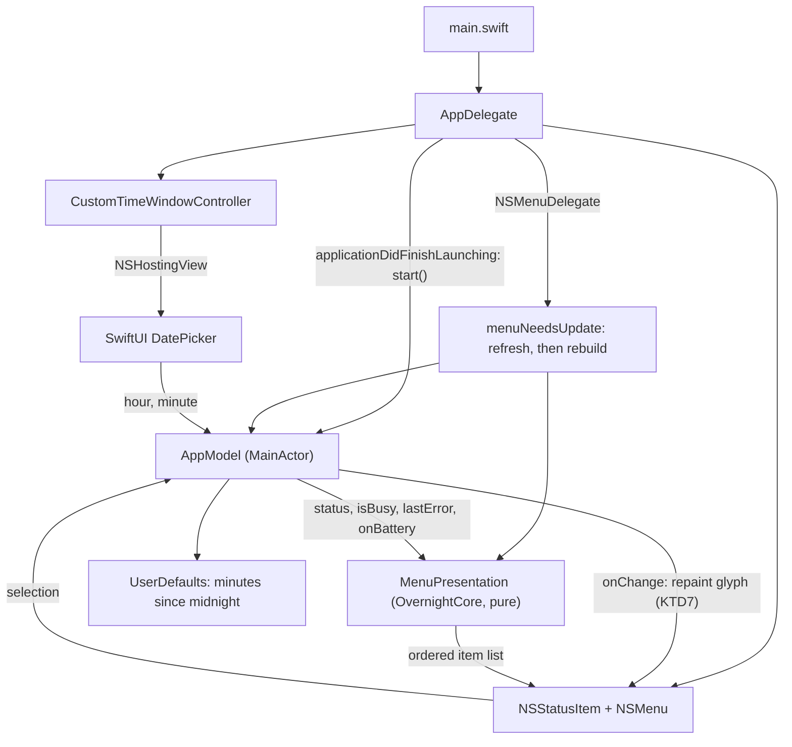
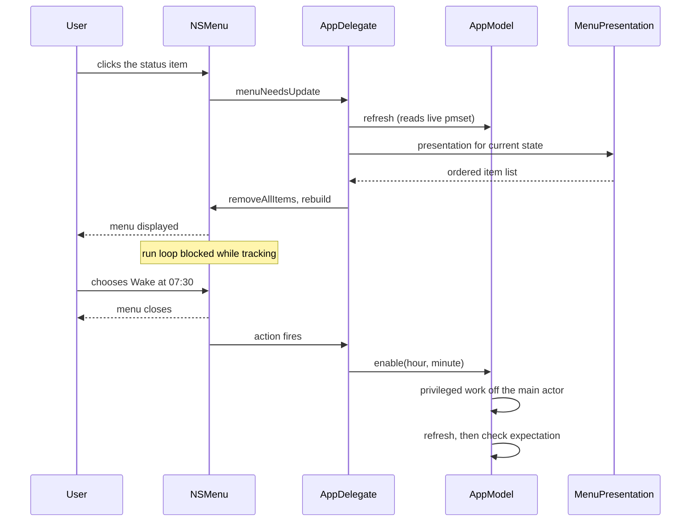

# Native Menu-Bar Menu - Plan

## Goal Capsule

- **Objective:** Opening Overnight from the menu bar answers "is it on, and until when?" in the first line read, and turning it on or off costs one click. The app reads like the other utilities that live up there rather than like a small window.
- **Means:** An AppKit `NSStatusItem` and `NSMenu` rebuilt on open from a pure presentation model in `OvernightCore`, with a separate small window for a custom wake time (KTD1, KTD2, KTD3, KTD5).
- **Open blockers:** None.
- **Authority:** Requirements (R-IDs) win on product behavior. KTDs win on mechanism within those requirements. Units override neither.
- **Execution profile:** The implementing host is macOS, so `swift test` and `sh scripts/build-app.sh` both run locally. Menu rendering, submenu hover, check-mark placement, and window focus in an `LSUIElement` app cannot be asserted by any test and route to `docs/MANUAL-CHECKS.md`.
- **Stop conditions:** Stop and report if the `Wake at` submenu cannot be withheld in `externallyDisabled` (R15 exists to prevent an unrecoverable capture), if `start()` cannot be moved off first-menu-open so the AC watcher arms at launch (R16), if the menu-bar glyph cannot be made to follow status once no SwiftUI view observes the model (KTD7), or if the menu cannot be rebuilt on open so the state line can go stale without the user noticing.
- **Tail ownership:** The caller owns commit, push, and any release tagging.

---

## Product Contract

### Summary

Replace Overnight's inline SwiftUI panel with a native menu. The current state becomes the menu's disabled first item, wake times move into a `Wake at` submenu whose presets act immediately, and `Custom…` opens a small window for odd times. Warnings become menu items that keep their explanatory sentence as a tooltip, and the `externallyDisabled` state swaps its selectable code block for a copy-to-clipboard action.

### Problem Frame

The active-state panel spends most of its height on one job. Two steppers, three preset buttons, and an `Update Deadline` button all exist to pick a wake time, and the steppers only matter for times nobody picks. Turning Overnight on is two gestures — set the steppers, then press the button — for a single intent.

Meanwhile the one fact a user opens the panel to learn, the deadline, is rendered as the smallest and greyest text on the panel, below a bold app name the user already knows. `Refresh` and `Quit` hold a permanent row for actions used almost never.

`Sources/Overnight/OvernightApp.swift:20` records the original reasoning for the panel: a plain menu would push the time choice into nested items. That is true, and it is now judged the better trade — the nesting costs one hover on the uncommon path and buys a one-click common path. Apple's own guidance agrees: the Human Interface Guidelines direct a menu bar extra to display a menu rather than a popover unless the functionality is too complex for a menu.

### Key Decisions

- **Native menu over the inline panel.** (session-settled: user-directed — chosen over keeping the `.window` popover: three controls did one job and the state line was the panel's quietest text.) Governs R1, R2, R4, R5. Reverses the note at `Sources/Overnight/OvernightApp.swift:20`.
- **Presets plus a separate custom window, over a wider preset list.** (session-settled: user-directed — chosen over presets-only: odd times such as 07:15 stay reachable, at the cost of a second window scene.) Governs R3, R7.
- **Warnings render as plain menu items.** (session-settled: user-approved — chosen over keeping a highlighted box: a menu has no box affordance.) Governs R9, R14. The running-on-battery case loses the most from this. Its mitigation is behavioral and already shipped: `AppModel.handlePowerSourceChange` restores automatically on unplug, so the warning covers only the case where nobody is present to approve the prompt.
- **The custom time persists across launches.** (session-settled: user-approved — chosen over defaulting every time: a user whose wake time is never a preset would re-enter it nightly.) Governs R8.
- **Overnight offers no action in a state it did not create.** Governs R15. `OvernightStatus.canRestore` already encodes this for restoring; R15 extends the same rule to enabling. Added during planning — see Product Contract preservation below.

**Product Contract preservation:** changed. R1, R2, R4–R8, R10–R12 unchanged. R3 and R9 clarified with no scope change (R3 gains the unmatched-deadline and nil-deadline cases; R9 gains the tooltip that preserves the explanatory sentence the panel already showed, which the Scope Boundary's no-rewrite rule requires). R13–R18 added, none of which the brainstorm addressed: R15 closes a safety path this change would otherwise open, and R13, R14, R16, R17 and R18 cover the custom window's staleness, warning precedence, startup at launch, refresh on open, and in-flight operations.

### Requirements

**Menu structure**

- R1. The menu-bar item opens a native menu. No inline panel, no custom frame, no custom padding.
- R2. The first item is the current state, disabled and non-actionable: `On until Sun 07:30` while active, and the equivalent one-line statement for each of the other four states.
- R3. Wake times are chosen from a `Wake at` submenu holding the three presets — 06:30, 07:30, 08:30 — plus `Custom…`. While Overnight is active, a check mark marks the item matching the current deadline; when the deadline matches no preset, `Custom…` carries it; when the deadline is unknown, nothing is checked.

**Turning on and off**

- R4. Choosing a preset from the `Wake at` submenu while Overnight is off sets that wake time and turns Overnight on in the same action. There is no separate commit item.
- R5. Choosing a preset while Overnight is active changes the deadline immediately, including when that preset is the one already checked, which re-arms a missing restore timer.
- R6. `Turn Off Now` is a single top-level item that restores the captured settings.

**Custom time**

- R7. `Custom…` opens a small window holding an hour and minute picker and one confirming action. Dismissing the window without confirming changes nothing.
- R8. The custom window opens on the last time the user confirmed there, and that value survives quitting and relaunching the app.
- R13. Confirming the custom window applies to the state the machine is in when it is confirmed, never to the state it was opened against. The window closes without acting when `canEnable` has become false underneath it. Confirming while Overnight is off turns it on, exactly as a preset does under R4.

**Warnings and non-Overnight states**

- R9. Each condition the current panel warns about — running on battery, a missing restore timer, a failed operation — appears as a disabled menu item carrying a warning symbol and a one-line message, placed between the state item and the first actionable item. The panel's longer explanation for that condition is available as the item's tooltip.
- R10. In the `externallyDisabled` state the menu offers no restore. Its only action copies `sudo pmset -a disablesleep 0` to the clipboard, replacing the panel's selectable code block. The state item itself is covered by R2.
- R11. The `offWithStaleState` cleanup action remains available as a menu item.
- R12. `Refresh` and `Quit` sit below a separator at the bottom of the menu.
- R14. At most one warning item is shown. When more than one condition holds, the order is: a failed operation, then a missing restore timer, then running on battery.

**App lifecycle and safety**

- R15. The `Wake at` submenu is offered only in states where Overnight may act. It is withheld in `externallyDisabled`, where enabling would record a foreign `SleepDisabled 1` as Overnight's baseline and leave every later restore re-disabling sleep.
- R16. Startup work runs when the app launches, not when the menu is first opened, so the AC-unplug watcher is armed whether or not the user has opened the menu.
- R17. The state the menu shows is re-read when the menu opens.
- R18. While a privileged operation is in flight, the state item says so and every item that would start or change one is withheld or disabled. No selection is accepted and silently dropped. `Refresh` and `Quit` stay usable, because neither goes through the in-flight guard and disabling `Quit` would strand the user behind a hung authorization prompt.

### Key Flows

- F1. Turning Overnight on
  - **Trigger:** Overnight is off and the user wants the machine held awake until a preset time.
  - **Steps:** Open the menu; the first item reads that Overnight is off. Open `Wake at`; choose 07:30. The administrator prompt appears once. The menu's state item now reads the deadline.
  - **Covered by:** R2, R3, R4, R17
- F2. Setting a wake time that is not a preset
  - **Trigger:** The user's alarm is at 07:15.
  - **Steps:** Open `Wake at`; choose `Custom…`. The window opens on the last custom time confirmed. Set 07:15 and confirm. The window closes and the deadline is set. Reopening `Wake at` shows the check mark on `Custom…`, not on a preset.
  - **Covered by:** R3, R7, R8, R13
- F3. Finding out why nothing can be restored
  - **Trigger:** Sleep is disabled on this Mac but Overnight holds no capture.
  - **Steps:** Open the menu; the state item says something else disabled sleep. No restore action is offered, and no `Wake at` submenu is offered either. The user chooses the copy action and pastes the command into Terminal.
  - **Covered by:** R10, R15

### Acceptance Examples

- AE1. **Covers R4.** Given Overnight is off, when the user chooses `Wake at ▸ 07:30`, then the administrator prompt appears once and Overnight turns on with a deadline at the next 07:30.
- AE2. **Covers R5.** Given Overnight is active until 07:30, when the user chooses `Wake at ▸ 06:30`, then the deadline moves to the next 06:30 and Overnight stays on without a second turn-on.
- AE3. **Covers R3.** Given Overnight is active until 07:15, when the user opens the `Wake at` submenu, then no preset carries a check mark and `Custom…` does.
- AE4. **Covers R7.** Given the custom window is open showing 07:15, when the user closes it without confirming, then the deadline is unchanged.
- AE5. **Covers R6, R9, R14.** Given Overnight is active and the Mac is on battery, when the user opens the menu, then the item below the state item is a disabled warning and `Turn Off Now` is the first actionable item.
- AE6. **Covers R15.** Given the status is `externallyDisabled`, when the user opens the menu, then no `Wake at` submenu is present and no item can call enable.
- AE7. **Covers R3.** Given Overnight is active with an unknown deadline, when the user opens the `Wake at` submenu, then no item carries a check mark.
- AE8. **Covers R18.** Given a privileged operation is in flight, when the user opens the menu, then the state item says so, `Wake at` is absent entirely, and `Turn Off Now` and the cleanup item are present but disabled.
- AE9. **Covers R14.** Given Overnight is active, the Mac is on battery, and the last operation failed, when the user opens the menu, then exactly one warning item is shown and it is the failed-operation one.

### Success Criteria

- Someone who opens the menu to answer "is it on, and until when?" gets the answer from the first item without opening a submenu.
- The menu's state item matches live `pmset` output at the moment the menu opens, not at the moment the app last polled.

### Scope Boundaries

- The enable, disable, and restore mechanism is untouched: the capture format, the privileged payload, the one-shot `launchd` job, and the menu-bar glyph all stay as they are.
- No preferences surface beyond the custom-time window. Editing which three times appear as presets is not in scope.
- No notification or alert when the deadline fires.
- The wording of each state line and warning is carried over from the current panel, not rewritten.

#### Deferred to Follow-Up Work

- **Quitting while nothing will restore.** `Quit` terminates with no `applicationWillTerminate` handling. In `activeTimerMissing` there is no restore job, so quitting leaves `SleepDisabled 1` set with no UI left to clear it, and in a menu `Quit` sits one row below `Refresh` where it is easier to mis-click than it was in the panel. The danger predates this change; the adjacency does not. Worth its own change: restore on terminate whenever `canRestore` holds and the job is missing.
- **A third menu-bar glyph state for degraded conditions.** `MenuBarBand` produces pure geometry that CI asserts against, so a badge path is cheap to add and would signal running-on-battery on the always-visible surface. Apple does this (Time Machine, Battery); none of the surveyed third-party utilities do. Outside this plan's scope because it changes the icon contract and its asset checks.
- **HIG title-style capitalization of menu items.** `On until Sun 07:30` is sentence case; the Apple Style Guide capitalizes prepositions of five or more letters, making `On Until Sun 07:30` strict-correct. Apple's own Focus menu uses sentence case, so this is genuinely contested. Deferred because the Scope Boundary above forbids rewriting carried-over wording in this change.

---

## Planning Contract

### Key Technical Decisions

- KTD1. **Build the menu in AppKit with `NSStatusItem` and `NSMenu`, not SwiftUI's `.menuBarExtraStyle(.menu)`.** Chosen over keeping `MenuBarExtra`, which was measured to render every visual element correctly but exposes no menu-open event at all: its internal delegate implements `menuNeedsUpdate:` and `menuDidClose:` but not `menuWillOpen:`, and `onAppear` fires exactly once at first population. `NSMenuDelegate.menuNeedsUpdate(_:)` is what makes R17 possible. AppKit also supplies three things SwiftUI's menu style cannot: `NSMenuItem.toolTip` for R9's explanation, `NSMenuItem.state` for R3's check mark with no `Picker` chrome and without swallowing R5's re-arm, and `attributedTitle` for a secondary qualifier. It removes two behaviors that could not be confirmed on the macOS 13 deployment target — whether `onAppear` fires there at all, and whether `Label` icons render in a menu, which Apple's documentation says they do not and live measurement on macOS 26.6 says they do. Governs R1, R3, R5, R9, R17. (session-settled: user-approved — chosen over keeping `MenuBarExtra(.menu)`: every comparable utility builds its menu in AppKit, the missing menu-open event is an open Apple Feedback request rather than a stable design, and `NSMenuItem`'s `state`, `toolTip` and `attributedTitle` are what R3, R9 and R17 need.)

  This reverses `docs/plans/2026-09-09-overnight-menu-bar-app.md` KTD1, which recorded `MenuBarExtra` as `session-settled: user-directed`, chosen over "an AppKit `NSStatusItem` app" because it was "the smallest native path to a menu-bar control." That was true of a popover. The premise changed with the move to a native menu; the earlier judgment did not become wrong.
- KTD2. **Replace the SwiftUI `App` entry point with an AppKit `NSApplicationDelegate`.** (session-settled: user-approved — chosen over a hybrid that keeps a never-inserted `MenuBarExtra(isInserted:)` or `Settings { EmptyView() }` scene only to satisfy `App.body`: the hybrid buys the `@main struct … : App` spelling and costs two lifecycles with ambiguous ownership of `AppModel`.) Follows from KTD1: with no `MenuBarExtra` there is no scene to hang the status item on, and a `Window` scene declared only for the custom-time picker would open at launch. `applicationDidFinishLaunching(_:)` is then the home R16 needs for `AppModel.start()`. SwiftUI is kept for the custom-time picker's content inside an `NSHostingView`.
- KTD3. **Move menu presentation into `OvernightCore` as a pure function of `(status, onBatteryWhileActive, lastError, isBusy, calendar)` returning an ordered item list.** The calendar is injected and the deadline formatter carries a pinned `locale` and `timeZone`, because `Tests/OvernightCoreTests/DeadlineTests.swift:6-11` pins a calendar for exactly this reason and the formatter at `Sources/Overnight/MenuContentView.swift:18-22` sets neither. An item carries a semantic kind, never an SF Symbol name or an `NSControl.StateValue`, so `OvernightCore` stays AppKit-free; `MenuBuilder` maps kind to symbol and image the way `MenuBarIcon` maps curves to an image. Only `OvernightCore` has a test target; the `Overnight` executable target has none. Today `statusLine` and the deadline `DateFormatter` live in the view at `Sources/Overnight/MenuContentView.swift:67-88` and are untestable. Moving them down is what lets AE1–AE9 land as tests rather than as manual checks. Governs R2, R3, R9, R14, R18.
- KTD4. **Add `OvernightStatus.canEnable`, mirroring the existing `canRestore`.** The safety rule R15 states belongs next to the rule it parallels, in the same tested type, not in a view condition. `canEnable` is false for `externallyDisabled` and true elsewhere. Governs R15.
- KTD5. **Hold the custom time as minutes-since-midnight in `UserDefaults`, and never let a picker `Date` reach `Deadline`.** `DatePicker` on macOS assigns an arbitrary seconds value, and this app builds a `launchd` `StartCalendarInterval` from the chosen time. Normalizing to `(hour, minute)` integers at the picker boundary keeps `Deadline`'s existing next-occurrence logic the only place that resolves a time. Governs R8.
- KTD6. **Schedule the refresh timer and the IOKit power-source source in common run-loop modes.** Governs R16, R18. `AppModel.swift:79` schedules the 30-second timer in `.default` only, and `PowerSourceMonitor.swift:54` adds its source with `.defaultMode` (removing it with the same mode at line 59). Menu tracking runs in `NSEventTrackingRunLoopMode`, so with a native menu neither fires while the menu is open — an unplug during tracking would go unnoticed. Invisible with a popover; visible with a menu. The consequence: those callbacks can now fire *while a menu is displayed*, and the menu is not rebuilt until it is reopened. An unplug during tracking sets `isBusy` under a menu whose `Turn Off Now` is still enabled, and the click is then dropped by `AppModel.swift:117` — the exact failure R18 exists to prevent. Item properties can be mutated during tracking even though structure cannot, so the fix is to re-apply enabled state from the change notification, or to call `cancelTracking()` when the model changes while the menu is open.

- KTD7. **Give the status item an explicit change path, and drop `ObservableObject` from `AppModel`.** Under KTD2 nothing observes `AppModel` any more, so the menu-bar glyph would freeze at whatever it was at launch — `Sources/Overnight/OvernightApp.swift:14` is the only thing updating it today, and it does so incidentally, because the icon happens to be built inside a SwiftUI view. With exactly one observer, `@Published` and `ObservableObject` earn nothing and force `import SwiftUI` into `Sources/Overnight/AppModel.swift:2`; a single `onChange` callback the delegate assigns is the honest shape. Governs R16.

### High-Level Technical Design

Ownership after the change. The menu is built from data, and the data comes from a tested pure function:

One menu open, end to end. The refresh happens before the rebuild, and the privileged work happens after the menu closes, because menu tracking blocks the run loop:

What the menu holds per status. `MenuPresentation` owns this mapping; the table is its specification:

| Status | State item | `Wake at` | `Turn Off Now` | Other action |
|---|---|---|---|---|
| `off` | Off. This Mac sleeps normally. | offered | — | — |
| `offWithStaleState` | Off, with a leftover state file to clean up. | offered | — | Clean up leftover state |
| `active` | On until `<deadline>`. | offered, checked | yes | — |
| `activeTimerMissing` | On, but the `<deadline>` timer is missing. | offered, checked | yes | — |
| `externallyDisabled` | Sleep is disabled, but not by Overnight. | **withheld (R15)** | — | Copy the command |

### Assumptions

- `openWindow` was measured to open a window from menu content but leave it neither key nor main in an `LSUIElement` app, with `NSApp.isActive` still false after `activate(ignoringOtherApps:)`. That test fired the action programmatically with no user gesture, so it cannot distinguish a broken activation from one correctly refused. The plan assumes a real click behaves better and calls `activate(ignoringOtherApps:)` — deprecated since the macOS 14 SDK but available and functional at the macOS 13 target, where the no-argument `NSApplication.activate()` does not exist. U5 carries the fallback.
- A `Settings` scene is assumed unusable: `SettingsLink` and `@Environment(\.openSettings)` are macOS 14+, and `NSApp.sendAction(Selector(("showSettingsWindow:")))` was removed in macOS 14. A plain window is also the semantically correct choice for a time picker.
- The AC watcher's automatic `disable()` is assumed to stay subject to the existing `guard !isBusy` in `AppModel.perform`. R18 makes the busy state visible; it does not change which operation wins. Whether an unplug should pre-empt a user operation already in flight is a behavior question this plan does not answer.

### Risks & Dependencies

- **An unrecoverable capture is one stray click away if R15 is not enforced.** With no `state.conf`, `payload/overnight-enable.sh:138-149` records the live `SleepDisabled` value as Overnight's baseline. In `externallyDisabled` that value is `1`, set by something else, so `payload/overnight-restore.sh:99-100` would replay `pmset -a disablesleep 1` on every restore — including the `launchd` deadline job — and the app could never re-enable sleep again. The current panel cannot reach this because it renders no Turn On button in that state. A native menu reaches it unless the submenu is withheld, which is why R15 exists and why KTD4 puts the rule in the tested type rather than in a view condition.
- **R9 depends on a tooltip behavior that is not verified.** `NSMenuItem.toolTip` is available at macOS 13, but whether AppKit displays a tooltip for a *disabled* item — one that never highlights — was not confirmed. R9 makes that tooltip the only home for the explanatory sentence the panel showed, and the Scope Boundary forbids rewriting that wording. Check this before U3 starts. If tooltips do not show, the fallback is `attributedTitle` with an embedded newline, which is available at macOS 13 where `NSMenuItem.subtitle` (macOS 14.4) is not.

- **`Label` icons on macOS 13 are moot under KTD1 but the warning must still read without its symbol.** R9's message carries the meaning; the symbol is decoration. Do not let the icon become the only signal.
- **Mixed icon groups.** The HIG requires icons on all items in a separator-delimited group or none. The warning item is the only item with a symbol, so it needs its own group above the first separator — which is also where R9's placement rule already puts it.
- **Dynamic item counts move the target.** The warning group appearing and disappearing must not shift `Turn Off Now` under a user's cursor. Keeping the warning above the first separator, and keeping one fixed primary action whose verb changes, is what holds the layout still.
- **No test can prove the menu renders.** Check-mark placement, submenu hover, the warning symbol on a disabled item, and window focus in an `LSUIElement` app are all screen-only. U6 adds the manual check.

### Open Questions

**Deferred to Planning**

- **Answered, kept for the record.** Whether to keep SwiftUI `MenuBarExtra(.menu)` or move to AppKit is settled in favour of AppKit; see KTD1 and KTD2. The rejected branch's costs are retained below because they are the reasons the choice was close.

  *Branch A, rejected — keep `MenuBarExtra(.menu)`.* R1–R18 hold either way; this decides KTD1, KTD2, and the shape of U2 through U6. It is blocking because the AppKit branch reverses a decision recorded as `session-settled: user-directed`, and because the two branches cost different requirements.

  *Branch A — keep `MenuBarExtra(.menu)`.* Honors the prior decision and is by far the smaller change: no new entry point, and the menu-bar glyph keeps updating for free because `Sources/Overnight/OvernightApp.swift:14` observes the model inside a SwiftUI view. Measurement confirms every visual element renders, and that the menu is rebuilt from live model state on each open. What it costs: **R17 weakens** — there is no menu-open event at all, so freshness comes only from the refresh timer and the state line can lag it; **R9 loses its tooltip**, so the explanatory sentence has no home and the one-line message must carry the whole meaning; and R5's re-arm needs a `Toggle` whose setter ignores its value, because a `Picker` fires nothing when the already-selected item is chosen. Two behaviors also remain unverified at the macOS 13 target: whether `onAppear` fires there at all, and whether `Label` icons render in a menu, which Apple's documentation says they do not and macOS 26.6 measurement says they do.

  *Branch B, chosen — move to AppKit.* Its costs are carried by KTD7 and by U2's steps rather than left open: the glyph needs an explicit change path, two `AppModel` comments become false, a minimal main menu is needed for the custom window's editing shortcuts and for ⌘Q, `main.swift` must hold the delegate strongly because `NSApplication.delegate` is `weak`, and the notification-authorization prompt must not move to first launch.

  A hybrid — a never-inserted `MenuBarExtra(isInserted:)` or `Settings { EmptyView() }` scene kept only to satisfy `App.body` while AppKit owns the real status item — was considered and rejected: it buys only the words `@main struct OvernightApp: App` and costs two lifecycles with ambiguous ownership of `AppModel`.

**Deferred to Planning**

- Whether `MenuPresentation` should live in `OvernightCore` or in a third `OvernightMenu` target. Core is acceptable while the AppKit-flavored fields stay out per KTD3, and `MenuBarBand` is the precedent for view math living there. A third target is three lines in `Package.swift` if the layering proves uncomfortable.
- Whether to merge U2 into U3. After U2 alone the app has a status item and no menu — clickable, inert, and quittable only by `killall`, because `Quit` does not exist until U3.

---

## Implementation Units

### U1. Pure menu presentation and the `canEnable` rule in `OvernightCore`

- **Goal:** The whole menu becomes a tested pure function before any AppKit code exists.
- **Requirements:** R2, R3, R9, R14, R15, R18. Covers AE3, AE6, AE7, AE8, AE9.
- **Dependencies:** none.
- **Files:**
  - `Sources/OvernightCore/OvernightStatus.swift` (modify — add `canEnable`)
  - `Sources/OvernightCore/MenuPresentation.swift` (create)
  - `Sources/OvernightCore/Deadline.swift` (modify — add the minutes-since-midnight conversion)
  - `Sources/OvernightCore/Paths.swift` (modify — add the recovery command string)
  - `Tests/OvernightCoreTests/MenuPresentationTests.swift` (create)
  - `Tests/OvernightCoreTests/OvernightStatusTests.swift` (modify)
  - `Tests/OvernightCoreTests/DeadlineTests.swift` (modify)
- **Approach:**
  1. Add `canEnable` to `OvernightStatus` beside `canRestore`, per KTD4. False for `externallyDisabled`; true for the other four.
  2. Add a `MenuPresentation` type describing the menu as data: an ordered list of items, each carrying its title, an optional tooltip, an optional symbol name, whether it is enabled, whether it is checked, and which action it maps to. Per KTD3 it is a pure function of `(status, onBattery, lastError, isBusy)`.
  3. Move four pieces down verbatim — the Scope Boundary forbids rewriting them: the `EEE HH:mm` formatter (`Sources/Overnight/MenuContentView.swift:18-22`), the preset list (`:12`), `statusLine` (`:74-87`), and `formatted(_:)` (`:89-92`). Keep the terminal periods the current wording carries; menu convention would drop them, but that is a rewrite and is deferred.
  4. Encode the warning precedence R14 states, and the check-mark rule R3 states including the unmatched and nil-deadline cases. Match a preset by comparing the hour and minute components of the deadline against an **injected** calendar, since `state.conf` stores an absolute epoch and never round-trips `Deadline`'s `hour`/`minute`.
  5. Add `Deadline.init(minutesSinceMidnight:)` and a `minutesSinceMidnight` accessor rather than a separate custom-time type. `Deadline.swift:32-33` already owns the hour and minute range rule and `:69` already formats `07:05`; a second type restating either would be a second home for one invariant, which `scripts/check-managed-keys.sh` exists to prevent.
  6. Put the `sudo pmset -a disablesleep 0` recovery string in `OvernightCore` beside `OvernightPaths.pmsetExecutable`, so the text shown in the menu and the text copied to the clipboard cannot drift.
- **Patterns to follow:** `OvernightStatus.derive` — a pure function of its inputs with no I/O, so it can be tested without a Mac. `Tests/OvernightCoreTests/OvernightStatusTests.swift` for the test shape, including its existing habit of naming the acceptance example a test enforces.
- **Test scenarios:**
  - Covers AE6. `canEnable` is false for `externallyDisabled` and true for `off`, `offWithStaleState`, `active`, `activeTimerMissing`.
  - Covers AE6. The presentation for `externallyDisabled` contains no item mapping to the enable action, and contains the copy action.
  - Covers AE3. A deadline of 07:15 with presets 06:30/07:30/08:30 checks the custom item and no preset.
  - Covers AE7. `active(deadline: nil)` checks nothing.
  - A deadline of exactly 07:30 checks the 07:30 preset and nothing else.
  - Covers AE9. With `lastError` set, on battery, and active, exactly one warning item is present and it is the failed-operation one.
  - With a missing timer and on battery, exactly one warning item is present and it is the missing-timer one.
  - Covers AE8. With `isBusy` true, every actionable item is disabled and the state item reports the operation.
  - The state item for each of the five statuses matches the wording currently in `MenuContentView.statusLine`.
  - Each warning item carries a non-empty tooltip distinct from its title.
  - A deadline one minute either side of a preset does not check that preset.
  - The same inputs with two different injected calendars produce the state line each calendar implies, proving no host dependence.
  - Minutes-since-midnight round-trips to and from `(hour, minute)` for 00:00, 07:15, 12:00, and 23:59, and an out-of-range value throws `Deadline`'s existing typed error rather than a new one.
- **Verification:** `swift test` passes with the new cases, the presentation type compiles with no AppKit import, and no test result changes when the runner's locale or time zone changes.

### U2. AppKit entry point, launch-time startup, and run-loop modes

- **Goal:** The app owns its own lifecycle instead of bootstrapping from a view, keeps its glyph following status, and notices power changes while a menu is open.
- **Requirements:** R16. Implements KTD7.
- **Dependencies:** none. U2 consumes nothing from U1 and could land on its own: R16 is a live bug today, because the AC-unplug watcher does not arm until the user first opens the menu.
- **Files:**
  - `Sources/Overnight/main.swift` (create)
  - `Sources/Overnight/AppDelegate.swift` (create)
  - `Sources/Overnight/OvernightApp.swift` (delete)
  - `Sources/Overnight/AppModel.swift` (modify — drop `ObservableObject`, add `onChange`, split `start()`)
  - `Sources/Overnight/PowerSourceMonitor.swift` (modify)
  - `Sources/Overnight/MainMenu.swift` (create)
- **Approach:**
  1. Replace the `@main struct OvernightApp: App` entry point with an AppKit one per KTD2: a `main.swift` that sets the activation policy to `.accessory` and runs the application with a delegate.
  2. Move `AppModel.start()` to `applicationDidFinishLaunching(_:)`, which is what R16 requires. Keep `start()` idempotent — it is no longer called repeatedly, but nothing should depend on that.
  3. Create the `NSStatusItem` in the delegate and give it the existing `MenuBarIcon.image(active:)` and accessibility label. The glyph contract does not change.
  4. Per KTD6, schedule the refresh timer with `RunLoop.main.add(_:forMode: .common)` rather than `Timer.scheduledTimer`, and change `PowerSourceMonitor` to `.commonModes` at both the add site and the matching remove site (`:54` and `:59` must agree, or the source is never removed).
  5. Per KTD7, replace `ObservableObject` and the four `@Published` properties with a single `onChange` callback, and have the delegate repaint `statusItem.button?.image` and its accessibility label from `MenuBarIcon.image(active:)` whenever it fires. This is what stops the glyph freezing; nothing else observes the model after U2.
  6. Leave the notification-authorization request out of launch. Moving all of `start()` to `applicationDidFinishLaunching` would raise a system permission dialog on first launch of an app with no window and no Dock icon. Arm the watcher and the timer at launch; request notification authorization on the first menu open.
  7. Hold the delegate in a strong top-level binding in `main.swift`, and retain the `NSStatusItem` on the delegate. `NSApplication.delegate` is a `weak` property, so assigning a freshly constructed delegate inline deallocates it immediately.
  8. Install a minimal main menu with an App menu carrying ⌘Q and an Edit menu carrying the standard cut, copy, paste, select-all and undo items. SwiftUI's `App` synthesized one; a bare `NSApplication` has none, and without it those shortcuts stop working inside the custom-time window.
- **Execution note:** `LSUIElement` is already set in `resources/Info.plist`, so the activation policy is belt-and-braces rather than the mechanism. Verify the app still has no Dock icon after the entry-point change before going further.
- **Patterns to follow:** `MenuBarIcon.image(active:)` and `MenuBarIcon.label(active:)` already give the glyph and its VoiceOver label for a boolean; step 5 changes only who calls them and when. Declare the delegate `@MainActor` — `NSApplicationDelegate`'s methods are already main-actor in the SDK — and then `AppModel`'s `nonisolated init()` workaround at `Sources/Overnight/AppModel.swift:25-29` is no longer needed. Its comment, and the `start()` comment at `:30` describing the menu appearing many times, both describe constructs this unit deletes; rewrite them rather than leaving them to mislead.
- **Test scenarios:**
  - No new unit coverage: the entry point, status item and main menu are AppKit wiring with no logic to assert, and the `Overnight` target has no test target.
  - `sh scripts/build-app.sh` produces a bundle that launches with no Dock icon and a menu-bar glyph.
  - Covers KTD7. With Overnight turned on and off, the glyph changes between its broken and continuous forms without the menu being reopened.
  - The glyph follows a restore that happens while the app is idle, within one refresh interval, with no menu interaction at all.
  - With Overnight active, unplugging AC while the menu is open produces the warning and the restore prompt — the behavior KTD6 exists for, and the one `docs/MANUAL-CHECKS.md` M7 already tests by hand.
  - First launch of a fresh install raises no notification-permission dialog until the menu is opened.
  - Inside the custom-time window, ⌘C, ⌘V and ⌘A work, and ⌘Q quits the app.
- **Verification:** the app launches, shows its glyph, arms the AC watcher without the menu ever having been opened, and the glyph tracks every status change afterwards.

### U3. Build the menu from the presentation model

- **Goal:** The menu is rebuilt on every open from U1's item list, so it cannot show a state the machine has left.
- **Requirements:** R1, R2, R9, R10, R11, R12, R14, R17, R18. Realizes F3. Covers AE5, AE8, AE9.
- **Dependencies:** U1, U2.
- **Files:**
  - `Sources/Overnight/MenuBuilder.swift` (create)
  - `Sources/Overnight/AppDelegate.swift` (modify)
- **Approach:**
  1. Make the delegate the menu's `NSMenuDelegate`. In `menuNeedsUpdate(_:)` call `AppModel.refresh()`, then `removeAllItems()` and rebuild from `MenuPresentation`. This is the whole of R17.
  2. Translate each presentation item into an `NSMenuItem`: title, `toolTip`, `image` from the symbol name, `isEnabled`, and `state` for the check mark.
  3. Place the warning group above the first separator so it cannot displace the action items, per R9 and the layout risk above. Give the warning its own separator-delimited group so the mixed-icon rule holds.
  4. Wire the top-level actions to `AppModel`: `Turn Off Now`, the `offWithStaleState` cleanup, `Refresh`, `Quit`, and the `externallyDisabled` copy action. Put the command text in the copy item's tooltip.
  5. Use a monospaced-digit font on items whose titles contain times so `06:30` and `07:30` do not jitter.
  6. Re-apply item enabled state, or cancel tracking, when the model changes while the menu is open, per KTD6's consequence. Without this, R18 holds only for state that was already true when the menu opened.
  7. Gate the refresh so it runs for a real open rather than for key-equivalent matching. `AppModel.refresh()` forks `/usr/bin/pmset -g` and blocks (`CommandRunner.swift:41-44`), so an ungated refresh puts a process spawn in front of every menu appearance. Measure what `menuNeedsUpdate:` is actually called for before choosing between `propertiesToUpdate`, `menuHasKeyEquivalent:`, and a short debounce.
- **Approach note on timing:** a menu blocks the run loop while open, so an action must complete after the menu closes rather than during tracking. `AppModel.perform` already hops off the main actor for the privileged work, so this falls out of the existing design rather than needing new machinery.
- **Patterns to follow:** `MenuBarIcon` for building an `NSImage` with an accessibility description set; the same treatment applies to the warning symbol.
- **Test scenarios:**
  - No unit coverage for the AppKit translation itself; U1 owns the assertions about what the menu should contain. The translation is exercised by the manual checks in U6.
  - Covers AE5. Manual: with Overnight active on battery, the item below the state item is a greyed warning and `Turn Off Now` is the first item that can be chosen.
  - Manual: the copy action puts `sudo pmset -a disablesleep 0` on the clipboard and the item's tooltip shows the command.
  - Manual: the state item changes between two menu opens when the deadline job fires in between, with no `Refresh` needed.
- **Verification:** every status renders the item list U1's tests describe, and opening the menu twice across a state change shows the change without `Refresh`.

### U4. The `Wake at` submenu

- **Goal:** One click sets a wake time, and the same click re-arms a missing timer.
- **Requirements:** R3, R4, R5, R15. Realizes F1, and the submenu half of F2. Covers AE1, AE2, AE3, AE6, AE7.
- **Dependencies:** U1, U3.
- **Files:**
  - `Sources/Overnight/MenuBuilder.swift` (modify)
- **Approach:**
  1. Build the submenu only when `OvernightStatus.canEnable` is true, per R15 and KTD4. Withholding it is the safety property, so make it a single condition with no second path.
  2. Render the three presets and `Custom…` from the presentation model, setting `state` on the checked item.
  3. Map every preset selection to `AppModel.enable(hour:minute:)`. `changeDeadline` already calls `enable`, and the payload keeps an existing capture when `state.conf` is present, so one action serves R4 and R5 including the re-arm.
  4. Keep the ellipsis on `Custom…` and off `Turn Off Now`: the HIG reserves it for an action that needs more input first.
- **Patterns to follow:** `OvernightStatus.canRestore` and its use at `Sources/Overnight/MenuContentView.swift:139-152`, where a false rule removes the affordance entirely rather than disabling it. `canEnable` withholds the submenu the same way — one condition, no second path.
- **Test scenarios:**
  - U1 owns the assertions about which item is checked and whether the submenu exists.
  - Covers AE1. Manual: from off, choosing 07:30 raises one administrator prompt and the state item then reads the deadline.
  - Covers AE2. Manual: while active until 07:30, choosing 06:30 moves the deadline and does not raise a second turn-on.
  - Manual: while active with a missing timer, choosing the already-checked preset re-arms the job — verify the plist exists again at `/Library/LaunchDaemons/`.
  - Covers AE6. Manual: in `externallyDisabled`, no `Wake at` item is present.
- **Verification:** a preset chosen from either the off or the active state produces the deadline it names, and `externallyDisabled` offers no path to enable.

### U5. The custom-time window

- **Goal:** A time that is not a preset is reachable, and the window cannot act on a state that changed underneath it.
- **Requirements:** R7, R8, R13. Realizes the window half of F2. Covers AE4.
- **Dependencies:** U1, U4.
- **Files:**
  - `Sources/Overnight/CustomTimeWindowController.swift` (create)
  - `Sources/Overnight/CustomTimeView.swift` (create)
- **Approach:**
  1. Persist minutes since midnight per KTD5, using the `Deadline` conversion U1 adds. The `UserDefaults` read and write stay in the app target, and a stored value outside 0...1439 falls back to the previous panel default of 07:30 rather than reaching `Deadline`.
  2. Host a SwiftUI `DatePicker` with `displayedComponents: .hourAndMinute` in an `NSHostingView` inside a fixed-size, non-resizable window. The macOS default `.stepperField` style is the direct equivalent of the two steppers being removed.
  3. Normalize the picker's `Date` to hour and minute components before anything else sees it — the picker assigns arbitrary seconds, and a `launchd` calendar interval is built from this value.
  4. Bring the window forward with `activate(ignoringOtherApps:)` and `makeKeyAndOrderFront`. If a real click still leaves it unfocused, fall back to an `NSPanel` with `becomesKeyOnlyIfNeeded`; the Assumptions section records why this is uncertain.
  5. Satisfy R13 by re-reading the status at confirm time and acting on whatever state holds then, closing without acting only when `canEnable` is false. Do not gate on `isActive`: `Custom…` is offered when Overnight is off, and that is F2's own trigger. Choosing `Custom…` again while the window is open brings the existing window forward rather than opening a second one.
- **Test scenarios:**
  - U1 owns the minutes-since-midnight conversion assertions.
  - Covers AE4. Manual: dismissing the window without confirming leaves the deadline unchanged.
  - Manual: a confirmed custom time survives quitting and relaunching the app.
  - Manual: with the window open, letting the deadline fire and then confirming turns Overnight on for the new time, because `canEnable` is still true — it does not silently do nothing.
  - Manual: with the window open, something else disabling sleep makes `canEnable` false, and confirming then closes the window without acting.
  - Manual: the window takes keyboard focus when opened from the menu in the installed bundle.
- **Verification:** 07:15 is reachable and persists, and a stale window cannot re-enable Overnight.

### U6. Remove the panel, and record what only a screen can check

- **Goal:** No dead code, and the unverifiable parts have a written home.
- **Requirements:** R1.
- **Dependencies:** U3, U4, U5.
- **Files:**
  - `Sources/Overnight/MenuContentView.swift` (delete)
  - `docs/MANUAL-CHECKS.md` (modify)
  - `README.md` (modify)
- **Approach:**
  1. Delete `MenuContentView`. Confirm nothing in the app target still imports SwiftUI for the menu path; the custom-time view is the only remaining SwiftUI surface.
  2. Add an `M10` to `docs/MANUAL-CHECKS.md` covering what no test can answer: the state item renders disabled and non-actionable; the `Wake at` submenu opens on hover and the check mark lands on the right item; the warning symbol renders on a disabled item on the oldest supported macOS; the custom window takes focus in a bundle with no Dock icon; `Turn Off Now` does not move when a warning appears.
  3. Update the README where it describes what the menu bar shows, if the current wording describes the panel.
- **Test scenarios:** `Test expectation: none -- deletion and documentation. The behavior it removes is covered by U1's tests and the new M10.`
- **Verification:** `swift test` and `sh scripts/build-app.sh` both pass with no reference to the deleted view, and M10 is written in the same shape as the existing M6 through M9.

---

## Verification Contract

| Gate | Command | Applies to | Done signal |
|---|---|---|---|
| Unit tests | `swift test` | U1 | All tests pass, including the new `MenuPresentationTests` and the extended `DeadlineTests` and `OvernightStatusTests`. Baseline before this work is 66 tests, 0 failures. |
| Bundle build | `sh scripts/build-app.sh` | U2, U6 | `dist/Overnight.app` builds and launches with no Dock icon. |
| Shell and asset checks | the `shell` job in `.github/workflows/ci.yml` | all | Unchanged by this work; must stay green. |
| Manual menu checks | `docs/MANUAL-CHECKS.md` M10 | U3, U4, U5 | Each M10 item observed on a real Mac and recorded. |

Menu rendering has no automated gate. `swift test` proves what the menu *should* contain, because KTD3 moved that decision into `OvernightCore`; only M10 proves what it *does* contain.

---

## Definition of Done

- R1–R18 hold, and AE1–AE9 are either enforced by a test in `Tests/OvernightCoreTests/` or listed in `docs/MANUAL-CHECKS.md` M10.
- `swift test` passes and `sh scripts/build-app.sh` produces a launchable bundle.
- R15 is enforced in `OvernightStatus.canEnable` with a test, not in a view condition — the safety property does not live in presentation code.
- `AppModel.start()` arms the watcher and the timer at launch, the refresh timer and power-source source are both in common run-loop modes, and the notification-authorization request still waits for the first menu open.
- The menu-bar glyph tracks status with no menu open and no SwiftUI view observing the model. `README.md:88` calls the icon the status; a frozen glyph is a shipped regression that no test would catch.
- No comment in `Sources/Overnight/AppModel.swift` still describes the deleted SwiftUI scene or the menu appearing many times.
- `Sources/Overnight/MenuContentView.swift` and `Sources/Overnight/OvernightApp.swift` are deleted, with no orphaned references.
- `docs/MANUAL-CHECKS.md` carries M10.
- No experimental or dead-end code remains from abandoned approaches — in particular, no partially-migrated `MenuBarExtra` scene left alongside the AppKit entry point.

---

## Sources / Research

- `Sources/Overnight/MenuContentView.swift` — the panel being replaced. `:67-88` holds the state wording and formatter U1 moves down; `:137-152` is the `externallyDisabled` notice whose missing Turn On button is the guard R15 restores; `:62` is the whole-panel `isBusy` disable that R18 replaces.
- `Sources/Overnight/OvernightApp.swift:20` — the comment recording the `.window` choice this plan reverses.
- `Sources/OvernightCore/OvernightStatus.swift:32-37` — `canRestore`, the rule `canEnable` mirrors.
- `payload/overnight-enable.sh:131-149` — the fresh-capture branch. With no `state.conf` it records the live `SleepDisabled` value as the baseline, which is why enabling in `externallyDisabled` would capture a foreign `1`.
- `payload/overnight-restore.sh:99-100` — the replay that would then re-disable sleep on every restore, including the `launchd` job.
- `AppModel.swift:79` and `PowerSourceMonitor.swift:54` — the two `.default`-mode schedulings KTD6 changes.
- Apple Human Interface Guidelines, [The menu bar](https://developer.apple.com/design/human-interface-guidelines/the-menu-bar): a menu bar extra should display a menu rather than a popover unless the functionality is too complex for a menu. [Menus](https://developer.apple.com/design/human-interface-guidelines/menus): the ellipsis rule, the check-mark guidance, single-level submenus of about five items, uniform icon treatment within a group, and always showing the same set of items rather than hiding them.
- `NSMenuItem` availability at the macOS 13 target: `toolTip` and `attributedTitle` are available; `badge` and `sectionHeaderWithTitle:` are macOS 14, `subtitle` is macOS 14.4. This is why R9's explanation goes in a tooltip rather than a subtitle.
- SwiftUI `MenuBarExtra` menu-open behavior: its internal menu delegate implements `menuNeedsUpdate:` and `menuDidClose:` but not `menuWillOpen:`, and `onAppear` inside menu content fires once at first population. Open Feedback reports [#475](https://github.com/feedback-assistant/reports/issues/475) and [#477](https://github.com/feedback-assistant/reports/issues/477) request the missing event. This is KTD1's load-bearing reason.
- Prior art, all code-built `NSMenu` rebuilt in `menuNeedsUpdate:` with a disabled status item and presets in a one-level submenu: [KeepingYouAwake](https://github.com/newmarcel/KeepingYouAwake), [Caffeine](https://github.com/IntelliScape/caffeine). [Rectangle](https://github.com/rxhanson/Rectangle) swaps in a separate menu for its unauthorized state, which is the shape R15 and R10 give `externallyDisabled`.
